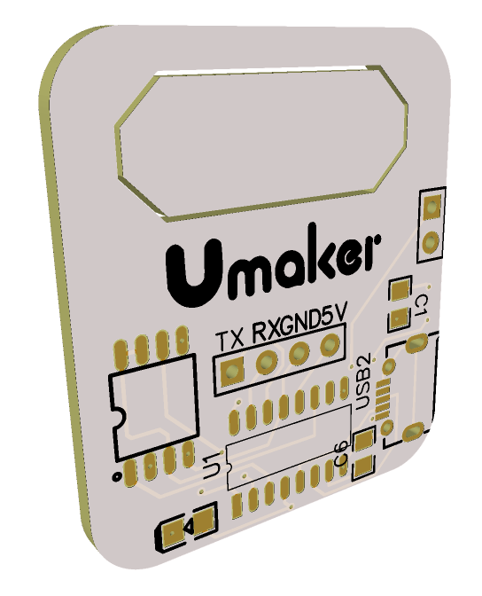
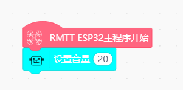

# TT 一线串口MP3模块




---------------------------------------------------------

## Table of Contents

* [URL](#url)
* [Summary](#summary)
* [Blocks](#blocks)
* [License](#license)
* [Supported targets](#Supportedtargets)

## URL
* Project URL : ```https://github.com/hanbozhang/TT-extend```


## Summary
TT语音扩展模块使用JQ8400作为播放芯片，使用自带的一线串口发送命令，也可以使用DF或网上的JQ8400模块进行学习和调试，一线串口定义到TTESP32中的IO26，播放状态检测BUSY定义到IO13上。

## Blocks


## Examples



## License

MIT

## Supported targets

 TTesp32 | Arduino C |      |      |      
------------------ | :----------: | :----------: | :---------: | -----


## Release Logs
* V0.0.1  Basic functions completed.